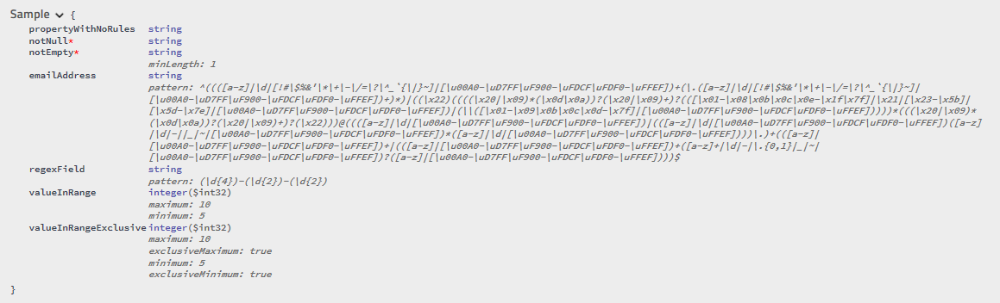

# MicroElements.Swashbuckle.FluentValidation
Use FluentValidation rules instead ComponentModel attributes to define swagger schema.

Note: For WebApi see: https://github.com/micro-elements/MicroElements.Swashbuckle.FluentValidation.WebApi

## Latest Builds, Packages
[](https://www.nuget.org/packages/MicroElements.Swashbuckle.FluentValidation/)
[](https://travis-ci.org/micro-elements/MicroElements.Swashbuckle.FluentValidation)

## Usage

### 1. Reference packages in your web project:
```xml
    <PackageReference Include="FluentValidation.AspNetCore" Version="7.5.2" />
    <PackageReference Include="MicroElements.Swashbuckle.FluentValidation" Version="0.4.0" />
    <PackageReference Include="Swashbuckle.AspNetCore" Version="2.3.0" />
```

### 2. Change Startup.cs

```csharp
        // This method gets called by the runtime. Use this method to add services to the container.
        public void ConfigureServices(IServiceCollection services)
        {
            services
                .AddMvc()
                // Adds fluent validators to Asp.net
                .AddFluentValidation(fv => fv.RegisterValidatorsFromAssemblyContaining<CustomerValidator>());

            services.AddSwaggerGen(c =>
            {
                c.SwaggerDoc("v1", new Info { Title = "My API", Version = "v1" });
                // Adds fluent validation rules to swagger
                c.AddFluentValidationRules();
            });
        }

        // This method gets called by the runtime. Use this method to configure the HTTP request pipeline.
        public void Configure(IApplicationBuilder app, IHostingEnvironment env)
        {
            app
                .UseMvc()
                // Adds swagger
                .UseSwagger();

            // Adds swagger UI
            app.UseSwaggerUI(c =>
            {
                c.SwaggerEndpoint("/swagger/v1/swagger.json", "My API V1");
            });
        }
```

## Sample application
See sample project: https://github.com/micro-elements/MicroElements.Swashbuckle.FluentValidation/tree/master/src/SampleWebApi

## Supported validators
* INotNullValidator (NotNull)
* INotEmptyValidator (NotEmpty)
* ILengthValidator (Length, MinimumLength, MaximumLength, ExactLength)
* IRegularExpressionValidator (Email, Matches)
* IComparisonValidator (GreaterThan, GreaterThanOrEqual, LessThan, LessThanOrEqual)
* IBetweenValidator (InclusiveBetween, ExclusiveBetween)

## Extensibility
You can register FluentValidationRule in ServiceCollection.

User defined rule name replaces default rule with the same.
Full list of default rules can be get by `FluentValidationRules.CreateDefaultRules()`

List or default rules:
* Required
* NotEmpty
* Length
* Pattern
* Comparison
* Between

Example of rule:
```
new FluentValidationRule("Pattern")
{
    Matches = propertyValidator => propertyValidator is IRegularExpressionValidator,
    Apply = context =>
    {
        var regularExpressionValidator = (IRegularExpressionValidator)context.PropertyValidator;
        context.Schema.Properties[context.PropertyKey].Pattern = regularExpressionValidator.Expression;
    }
},
```

## Samples

### Swagger Sample model and validator

```csharp
    public class Sample
    {
        public string PropertyWithNoRules { get; set; }

        public string NotNull { get; set; }
        public string NotEmpty { get; set; }
        public string EmailAddress { get; set; }
        public string RegexField { get; set; }

        public int ValueInRange { get; set; }
        public int ValueInRangeExclusive { get; set; }

        public float ValueInRangeFloat { get; set; }
        public double ValueInRangeDouble { get; set; }
    }

    public class SampleValidator : AbstractValidator<Sample>
    {
        public SampleValidator()
        {
            RuleFor(sample => sample.NotNull).NotNull();
            RuleFor(sample => sample.NotEmpty).NotEmpty();
            RuleFor(sample => sample.EmailAddress).EmailAddress();
            RuleFor(sample => sample.RegexField).Matches(@"(\d{4})-(\d{2})-(\d{2})");

            RuleFor(sample => sample.ValueInRange).GreaterThanOrEqualTo(5).LessThanOrEqualTo(10);
            RuleFor(sample => sample.ValueInRangeExclusive).GreaterThan(5).LessThan(10);

            // WARNING: Swashbuckle implements minimum and maximim as int so you will loss fraction part of float and double numbers
            RuleFor(sample => sample.ValueInRangeFloat).InclusiveBetween(1.1f, 5.3f);
            RuleFor(sample => sample.ValueInRangeDouble).ExclusiveBetween(2.2, 7.5f);
        }
    }
```

### Swagger Sample model screenshot


## Credits

Initial version of this project was based on
[Mujahid Daud Khan](https://stackoverflow.com/users/1735196/mujahid-daud-khan) answer on StackOwerflow:
https://stackoverflow.com/questions/44638195/fluent-validation-with-swagger-in-asp-net-core/49477995#49477995
