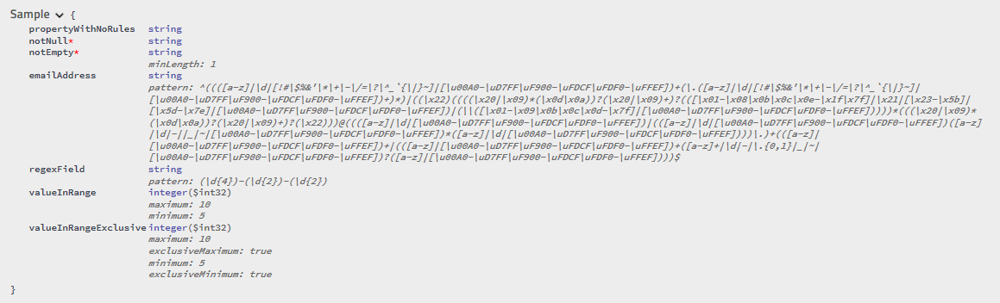

# MicroElements.Swashbuckle.FluentValidation
Use FluentValidation rules instead of ComponentModel attributes to define swagger schema.

Note: For WebApi see: https://github.com/micro-elements/MicroElements.Swashbuckle.FluentValidation.WebApi

## Statuses

[](https://raw.githubusercontent.com/micro-elements/MicroElements.Swashbuckle.FluentValidation/master/LICENSE)
[](https://www.nuget.org/packages/MicroElements.Swashbuckle.FluentValidation)

[](https://www.myget.org/feed/micro-elements/package/nuget/MicroElements.Swashbuckle.FluentValidation)


[](https://ci.appveyor.com/project/micro-elements/microelements-swashbuckle-fluentvalidation)
[](https://coveralls.io/r/micro-elements/MicroElements.Swashbuckle.FluentValidation)

[](https://gitter.im/micro-elements/MicroElements.Swashbuckle.FluentValidation)

### Supporting the project
MicroElements.Swashbuckle.FluentValidation is developed and supported by [@petriashev](https://github.com/petriashev) for free in his spare time.
If you find MicroElements.Swashbuckle.FluentValidation useful, please consider financially supporting the project via [OpenCollective](https://opencollective.com/micro-elements) which will help keep the project going 🙏.

## Usage

### 1. Minimal API

#### MinimalApi.csproj

```xml
<Project Sdk="Microsoft.NET.Sdk.Web">

    <PropertyGroup>
        <TargetFramework>net8.0</TargetFramework>
        <Nullable>enable</Nullable>
        <ImplicitUsings>enable</ImplicitUsings>
    </PropertyGroup>

    <ItemGroup>
        <PackageReference Include="FluentValidation.AspNetCore" Version="11.3.1" />
        <PackageReference Include="MicroElements.Swashbuckle.FluentValidation" Version="7.1.6" />
        <PackageReference Include="Swashbuckle.AspNetCore" Version="8.1.1" />
    </ItemGroup>
    
</Project>

```

#### Program.cs

```csharp
using FluentValidation;
using FluentValidation.AspNetCore;
using MicroElements.Swashbuckle.FluentValidation.AspNetCore;

var builder = WebApplication.CreateBuilder(args);
var services = builder.Services;

// Asp.Net stuff
services.AddControllers();
services.AddEndpointsApiExplorer();

// Add Swagger
services.AddSwaggerGen();

// Add FV
services.AddFluentValidationAutoValidation();
services.AddFluentValidationClientsideAdapters();

// Add FV validators
services.AddValidatorsFromAssemblyContaining<Program>();

// Add FV Rules to swagger
services.AddFluentValidationRulesToSwagger();

var app = builder.Build();

// Use Swagger
app.UseSwagger();
app.UseSwaggerUI();

app.MapControllers();

app.Run();
```

### 2. AspNetCore WebApi

#### Reference packages in your web project

```xml
<PackageReference Include="FluentValidation.AspNetCore" Version="11.3.1" />
<PackageReference Include="MicroElements.Swashbuckle.FluentValidation" Version="7.1.6" />
<PackageReference Include="Swashbuckle.AspNetCore" Version="8.1.1" />
```

#### Change Startup.cs

```csharp
// This method gets called by the runtime. Use this method to add services to the container.
public void ConfigureServices(IServiceCollection services)
{
    // Asp.net stuff
    services.AddControllers();
    
    // HttpContextValidatorRegistry requires access to HttpContext
    services.AddHttpContextAccessor();

    // Register FV validators
    services.AddValidatorsFromAssemblyContaining<Startup>(lifetime: ServiceLifetime.Scoped);

    // Add FV to Asp.net
    services.AddFluentValidationAutoValidation();

    // Add swagger
    services.AddSwaggerGen(c =>
    {
        c.SwaggerDoc("v1", new OpenApiInfo { Title = "My API", Version = "v1" });
    });

    // [Optional] Add INameResolver (SystemTextJsonNameResolver will be registered by default)
    // services.AddSingleton<INameResolver, CustomNameResolver>();

    // Adds FluentValidationRules staff to Swagger. (Minimal configuration)
    services.AddFluentValidationRulesToSwagger();

    // [Optional] Configure generation options for your needs. Also can be done with services.Configure<SchemaGenerationOptions>
    // services.AddFluentValidationRulesToSwagger(options =>
    // {
    //     options.SetNotNullableIfMinLengthGreaterThenZero = true;
    //     options.UseAllOffForMultipleRules = true;
    // });

    // Adds logging
    services.AddLogging(builder => builder.AddConsole());
}

// This method gets called by the runtime. Use this method to configure the HTTP request pipeline.
public void Configure(IApplicationBuilder app, IHostingEnvironment env)
{
    app.UseRouting();

    app.UseEndpoints(endpoints =>
    {
        endpoints.MapControllers();
    });

    // Adds swagger
    app.UseSwagger();

    // Adds swagger UI
    app.UseSwaggerUI(c =>
    {
        c.SwaggerEndpoint("/swagger/v1/swagger.json", "My API V1");
    });
}
```

## Version compatibility

| MicroElements.Swashbuckle.FluentValidation | Swashbuckle.AspNetCore | FluentValidation |
|--------------------------------------------|------------------------|------------------|
| [1.1.0, 2.0.0)                             | [3.0.0, 4.0.0)         | >=7.2.0          |
| [2.0.0, 3.0.0)                             | [4.0.0, 5.0.0)         | >=8.1.3          |
| [3.0.0, 3.1.0)                             | [5.0.0, 5.2.0)         | >=8.3.0          |
| [3.1.0, 4.2.1)                             | [5.2.0, 6.0.0)         | >=8.3.0          |
| [4.2.0, 5.0.0)                             | [5.5.1, 7.0.0)         | [9.0.0, 10)      |
| [5.0.0, 6.0.0)                             | [6.3.0, 7.0.0)         | [10.0.0, 12)     |
| [7.0.0, 8.0.0)                             | [8.0.0, 11.0.0)        | [11.0.0, 13)     |

> .NET 8/9 use Swashbuckle 8.x (Microsoft.OpenApi 1.x); .NET 10 uses Swashbuckle 10.x (Microsoft.OpenApi 2.x).

## Sample application

See sample project: https://github.com/micro-elements/MicroElements.Swashbuckle.FluentValidation/tree/master/samples/SampleWebApi

## Supported validators

* INotNullValidator (NotNull)
* INotEmptyValidator (NotEmpty)
* ILengthValidator (for strings: Length, MinimumLength, MaximumLength, ExactLength) (for arrays: MinItems, MaxItems)
* IRegularExpressionValidator (Email, Matches)
* IComparisonValidator (GreaterThan, GreaterThanOrEqual, LessThan, LessThanOrEqual)
* IBetweenValidator (InclusiveBetween, ExclusiveBetween)

## File uploads (media types & size) — Issue #216

Validation rules written on nested `IFormFile` members (e.g. `RuleFor(x => x.File.ContentType)` /
`RuleFor(x => x.File.Length)`) are **not** reflected in the OpenAPI document: FluentValidation names them
`File.ContentType` / `File.Length`, which never match the flat `File` schema property, and `Must(...)` carries
no introspectable metadata. Use the dedicated File-level rules instead:

```csharp
using MicroElements.OpenApi.FluentValidation.FileUpload;

public class UploadProductImageRequestValidator : AbstractValidator<UploadProductImageRequest>
{
    public UploadProductImageRequestValidator()
    {
        RuleFor(x => x.File)
            .NotNull()                                    // required
            .FileContentType("image/jpeg", "image/png")   // allowed media types
            .MaxFileSize(2 * 1024 * 1024);                // 2 MB
    }
}
```

These rules enforce the constraints at runtime **and** drive the OpenAPI output:

```yaml
multipart/form-data:
  schema:
    properties:
      File:
        type: string
        format: binary
        description: "Allowed content types: image/jpeg, image/png. Maximum file size: 2097152 bytes."
  encoding:
    File:
      contentType: "image/jpeg, image/png"
```

Available rules: `.FileContentType(params string[])`, `.MaxFileSize(long)`, `.MinFileSize(long)`,
`.FileSizeBetween(long, long)`.

Backend support:

| Backend | size & content types in `description` | machine-readable `encoding.contentType` |
|---|---|---|
| Swashbuckle | ✅ | ✅ (net8/9 = OpenAPI 3.0; net10 = OpenAPI 3.1) |
| NSwag | ✅ | ✅ via `FluentValidationOperationProcessor` (serialized as `encodingType` — a known NSwag limitation) |
| Microsoft.AspNetCore.OpenApi | ✅ | ❌ not emitted (see note) |

The issue scenario — making the generated OpenAPI document reflect the allowed content types and size limit — works on **all three** backends via the file part `description`. Only the extra machine-readable `encoding.contentType` field differs.

Notes:
- File **size** has no standard OpenAPI/JSON-Schema byte keyword, so it is documented in `description` only (annotation, not enforced by consumers; enforcement stays server-side via FluentValidation).
- NSwag requires registering the operation processor: `settings.OperationProcessors.Add(serviceProvider.GetService<FluentValidationOperationProcessor>())` (see the NSwag sample).
- Microsoft.AspNetCore.OpenApi: `encoding.contentType` is not emitted — its `IOpenApiOperationTransformer` does not write the multipart request body, and on net9 the transformer context cannot resolve a `$ref`'d form schema. On net10 the file part is emitted as a `$ref` to a shared `IFormFile` component, so the `description` is shared across all `IFormFile` endpoints (differing per-endpoint content-type rules would accumulate on that one component).

## Extensibility

You can register FluentValidationRule in ServiceCollection.

User defined rule name replaces default rule with the same.
Full list of default rules can be get by `FluentValidationRules.CreateDefaultRules()`

List or default rules:

* Required
* NotEmpty
* Length
* Pattern
* Comparison
* Between

Example of rule:

```csharp
new FluentValidationRule("Pattern")
{
    Matches = propertyValidator => propertyValidator is IRegularExpressionValidator,
    Apply = context =>
    {
        var regularExpressionValidator = (IRegularExpressionValidator)context.PropertyValidator;
        context.Schema.Properties[context.PropertyKey].Pattern = regularExpressionValidator.Expression;
    }
},
```

## Samples

### Swagger Sample model and validator

```csharp
public class Sample
{
    public string PropertyWithNoRules { get; set; }

    public string NotNull { get; set; }
    public string NotEmpty { get; set; }
    public string EmailAddress { get; set; }
    public string RegexField { get; set; }

    public int ValueInRange { get; set; }
    public int ValueInRangeExclusive { get; set; }

    public float ValueInRangeFloat { get; set; }
    public double ValueInRangeDouble { get; set; }
}

public class SampleValidator : AbstractValidator<Sample>
{
    public SampleValidator()
    {
        RuleFor(sample => sample.NotNull).NotNull();
        RuleFor(sample => sample.NotEmpty).NotEmpty();
        RuleFor(sample => sample.EmailAddress).EmailAddress();
        RuleFor(sample => sample.RegexField).Matches(@"(\d{4})-(\d{2})-(\d{2})");

        RuleFor(sample => sample.ValueInRange).GreaterThanOrEqualTo(5).LessThanOrEqualTo(10);
        RuleFor(sample => sample.ValueInRangeExclusive).GreaterThan(5).LessThan(10);

        // WARNING: Swashbuckle implements minimum and maximim as int so you will loss fraction part of float and double numbers
        RuleFor(sample => sample.ValueInRangeFloat).InclusiveBetween(1.1f, 5.3f);
        RuleFor(sample => sample.ValueInRangeDouble).ExclusiveBetween(2.2, 7.5f);
    }
}
```

### Swagger Sample model screenshot



### Validator with Include

```csharp
public class CustomerValidator : AbstractValidator<Customer>
{
    public CustomerValidator()
    {
        RuleFor(customer => customer.Surname).NotEmpty();
        RuleFor(customer => customer.Forename).NotEmpty().WithMessage("Please specify a first name");

        Include(new CustomerAddressValidator());
    }
}

internal class CustomerAddressValidator : AbstractValidator<Customer>
{
    public CustomerAddressValidator()
    {
        RuleFor(customer => customer.Address).Length(20, 250);
    }
}
```

### Nested objects (`SetValidator` / `ChildRules`)

Rules for a nested object are applied to the **child component schema**, and the parent property keeps a `$ref` to it. Both a standalone child validator (`SetValidator`) and inline `ChildRules` are supported (inline `ChildRules` `$ref` preservation was fixed in **7.1.6**, see [#198](https://github.com/micro-elements/MicroElements.Swashbuckle.FluentValidation/issues/198)):

```csharp
public class CreateUserRequest
{
    public CreateUserParams User { get; set; }
}

public class CreateUserParams
{
    public string Email { get; set; }
    public string Name { get; set; }
}

public class CreateUserRequestValidator : AbstractValidator<CreateUserRequest>
{
    public CreateUserRequestValidator()
    {
        // Inline child rules — no separate validator class required
        RuleFor(x => x.User)
            .NotEmpty()
            .ChildRules(user =>
            {
                user.RuleFor(u => u.Email).NotEmpty().EmailAddress();
                user.RuleFor(u => u.Name).NotEmpty().MaximumLength(510);
            });

        // Equivalent with a standalone validator:
        // RuleFor(x => x.User).NotEmpty().SetValidator(new CreateUserParamsValidator());
    }
}
```

The `Email`/`Name` constraints (and `required`) end up on the `CreateUserParams` component, while the parent stays a reference:

```json
"CreateUserRequest": {
  "required": [ "user" ],
  "type": "object",
  "properties": {
    "user": { "$ref": "#/components/schemas/CreateUserParams" }
  }
}
```

## Get params bounded to validatable models

MicroElements.Swashbuckle.FluentValidation updates swagger schema for operation parameters bounded to validatable models.

### Nested `[FromQuery]` parameters

When a `[FromQuery]` model has nested objects, ASP.NET Core flattens them into dot-path parameters (e.g. `RequiredSubType.SubProperty`). The validation rules for such a nested parameter are reflected in the OpenAPI document **only when they are actually enforced at runtime**:

- The nested validator must be wired from the **root** validator via `SetValidator`/`ChildRules` (since [7.1.7](https://github.com/micro-elements/MicroElements.Swashbuckle.FluentValidation/issues/211)). FluentValidation never auto-validates a child object just because a validator for it is registered in DI — so an unwired nested validator no longer leaks `required`/length/pattern constraints onto the parameter.
- A nested parameter is marked `required` only when **every** ancestor segment of the dot-path is required (see [#209](https://github.com/micro-elements/MicroElements.Swashbuckle.FluentValidation/issues/209)).

> **Note:** if there is **no** validator registered for the root `[FromQuery]` type (only a leaf/child validator), the flattened nested parameter is left unconstrained — matching the default runtime, where no validation runs without a root validator. If you instead validate the child manually in the controller (e.g. `new SubValidator().Validate(filter.Child)`), those constraints cannot be detected statically and so are not reflected in the schema — register/wire a validator for the root type if you want them documented.

## Defining rules dynamically from database

See BlogValidator in sample.

## Common problems and workarounds

### Error: `System.InvalidOperationException: 'Cannot resolve 'IValidator<T>' from root provider because it requires scoped service 'TDependency'`

Workarounds in order or preference:

#### Workaround 1 (Use HttpContextServiceProviderValidatorFactory) by @WarpSpideR

```csharp
public void ConfigureServices(IServiceCollection services)
{
    // HttpContextServiceProviderValidatorFactory requires access to HttpContext
    services.AddHttpContextAccessor();

    services
        .AddMvc()
        // Adds fluent validators to Asp.net
        .AddFluentValidation(c =>
        {
            c.RegisterValidatorsFromAssemblyContaining<Startup>();
            // Optionally set validator factory if you have problems with scope resolve inside validators.
            c.ValidatorFactoryType = typeof(HttpContextServiceProviderValidatorFactory);
        });
```

#### Workaround 2 (Use ScopedSwaggerMiddleware)

Replace `UseSwagger` for `UseScopedSwagger`:

```csharp
public void Configure(IApplicationBuilder app, IHostingEnvironment env)
{
    app
        .UseMvc()
        // Use scoped swagger if you have problems with scoped services in validators
        .UseScopedSwagger();
```

#### Workaround 3 (Set ValidateScopes to false)

```csharp
public static IWebHost BuildWebHost(string[] args) =>
    WebHost.CreateDefaultBuilder(args)
        // Needed for using scoped services (for example DbContext) in validators
        .UseDefaultServiceProvider(options => options.ValidateScopes = false)
        .UseStartup<Startup>()
        .Build();
```

## Problem: I cant use several validators of one type

Example: You split validator into several small validators but AspNetCore uses only one of them.

Workaround: Hide dependent validators with `internal` and use `Include` to include other validation rules to one "Main" validator.


## Problem: I'm using `FluentValidation` or `FluentValidation.DependencyInjectionExtensions` instead of `FluentValidation.AspNetCore`

If you are using the more basic `FluentValidation` or `FluentValidation.DependencyInjectionExtensions` libraries, then they will not automatically register `IValidatorFactory` and you will get an error at runtime: "ValidatorFactory is not provided. Please register FluentValidation." In that case you must register it manually (see [issue 97](https://github.com/micro-elements/MicroElements.Swashbuckle.FluentValidation/issues/97) for more details):
````cs
services.TryAddTransient<IValidatorFactory, ServiceProviderValidatorFactory>();
services.AddFluentValidationRulesToSwagger();
````

## Problem: Newtonsoft.Json DefaultNamingStrategy, SnakeCaseNamingStrategy does not work

```csharp

Startup.cs:

    .AddJsonOptions(options =>
    {
        options.JsonSerializerOptions.PropertyNamingPolicy = new NewtonsoftJsonNamingPolicy(new SnakeCaseNamingStrategy());
        //options.JsonSerializerOptions.DictionaryKeyPolicy = new NewtonsoftJsonNamingPolicy(new SnakeCaseNamingStrategy());
    })


    /// <summary>
    /// Allows use Newtonsoft <see cref="NamingStrategy"/> as System.Text <see cref="JsonNamingPolicy"/>.
    /// </summary>
    public class NewtonsoftJsonNamingPolicy : JsonNamingPolicy
    {
        private readonly NamingStrategy _namingStrategy;

        /// <summary>
        /// Creates new instance of <see cref="NewtonsoftJsonNamingPolicy"/>.
        /// </summary>
        /// <param name="namingStrategy">Newtonsoft naming strategy.</param>
        public NewtonsoftJsonNamingPolicy(NamingStrategy namingStrategy)
        {
            _namingStrategy = namingStrategy;
        }

        /// <inheritdoc />
        public override string ConvertName(string name)
        {
            return _namingStrategy.GetPropertyName(name, false);
        }
    }
```

## Credits

Initial version of this project was based on
[Mujahid Daud Khan](https://stackoverflow.com/users/1735196/mujahid-daud-khan) answer on StackOverflow:
https://stackoverflow.com/questions/44638195/fluent-validation-with-swagger-in-asp-net-core/49477995#49477995
